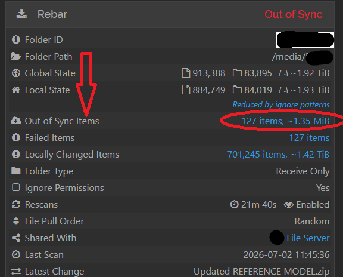
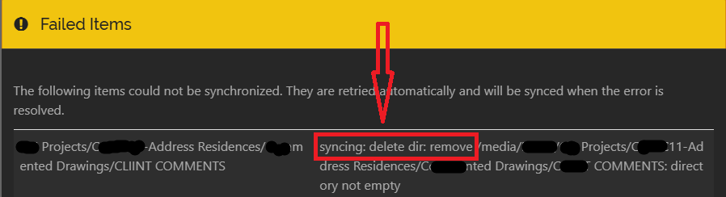

#### If Out of sync Error Occurs :
- If you encounter an **"out of sync"** error because files have been deleted (as shown in the picture below) from source machine but it still reflected in replication machine.
- Then  you have to delete those conflicts file and directory using commands  from the affected folder on the Linux machine where Syncthing is installed.

# Troubleshooting

| Issue                    | Possible Solution                                                                                                |
| ------------------------ | ---------------------------------------------------------------------------------------------------------------- |
| Devices not connecting   | Verify both Device IDs, ensure both systems have network connectivity, and allow Syncthing through the firewall. |
| Folder not synchronizing | Confirm that the folder is shared with the correct remote device and has been accepted.                          |
| Files not updating       | Verify that both devices show **Connected** and **Up to Date** in the Web GUI.                                   |
| Permission errors        | Ensure Syncthing has read/write permissions for the shared directory.                                            |
