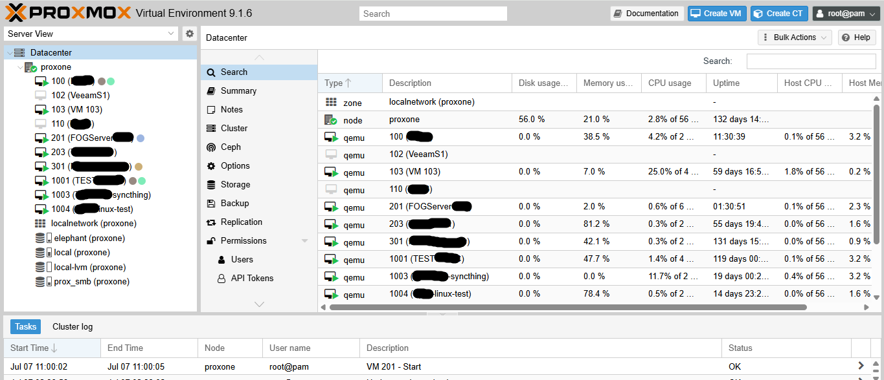

# Proxmox VE Installation & Initial Setup Guide

**Purpose**

This document describes the installation and initial configuration of the Proxmox Virtual Environment (PVE) server.

---

# Prerequisites

Before installation, ensure:
- Server hardware is available.
- BIOS/UEFI virtualization enabled (Intel VT-x / AMD-V).
- Boot mode configured (UEFI or Legacy).
- Network cable connected.
- Static IP information available.
- Proxmox ISO downloaded.
- Bootable USB created.

---

# 1.Installation Steps

### Step 1 – Boot from USB

- Insert bootable USB.
- Select USB as boot device.

---

### Step 2 – Start Installation

Select

```
Install Proxmox VE
```

---

### Step 3 – Accept License

Accept the EULA.

---

### Step 4 – Select Installation Disk

Choose installation disk.

Example:

```
/dev/sda
```

Filesystem:

- ext4
- ZFS (if used)

---

### Step 5 – Configure Location

Configure:

- Country
- Time Zone
- Keyboard Layout

---

### Step 6 – Administrator Account

Configure:

```
Email:
root Password:
```

---

### Step 7 – Network Configuration

Configure:

|Parameter|Example|
|---|---|
|Hostname|proxmox01.company.local|
|IP Address|192.168.1.20|
|Netmask|255.255.255.0|
|Gateway|192.168.1.1|
|DNS|8.8.8.8|

---

### Step 8 – Install

Wait for installation to complete.

Remove USB and reboot.

---

# 2. First Login

Open browser:

```
https://<Server-IP>:8006
```

Example:

```
https://192.168.1.20:8006
```

Login:
eg:
```
Username: TorukMakto
rootPassword: *Lisan-al-Gaib*
```

---

# 3. Post Installation Configuration

## Verify Network

```
ip addr
```

---

## Verify Storage

```
pvesm status
```

---

## Verify Cluster Status

```
pvecm status
```

---

## Check Version

```
pveversion
```

---

## Update Repository

Configure repositories if required.

Update packages:

```
apt updateapt full-upgrade -y
```

---

# 4. Storage Configuration

Document configured storage.

|Storage|Type|Purpose|
|---|---|---|
|local|Directory|ISO/Templates|
|local-lvm|LVM Thin|VM Disks|

---

# 5. Network Configuration

Document bridges.

Example:

|Bridge|Interface|IP|
|---|---|---|
|vmbr0|eno1|192.168.1.20|

---

# 6. VM Creation (Optional)


---

# 7. Verification Checklist

|Check|Status|
|---|---|
|Web UI Accessible|✔|
|Network Working|✔|
|Storage Available|✔|
|Updates Installed|✔|
|VM Created|✔|
|Backup Storage Added|✔|

---

# Troubleshooting

|Issue|Resolution|
|---|---|
|Cannot access Web UI|Check IP and firewall|
|Login Failed|Verify root password|
|Storage Missing|Check `pvesm status`|
|Network Down|Verify bridge configuration|


##### The following screenshot displays the Proxmox VE Dashboard after successful installation and virtual machine deployment.




***


